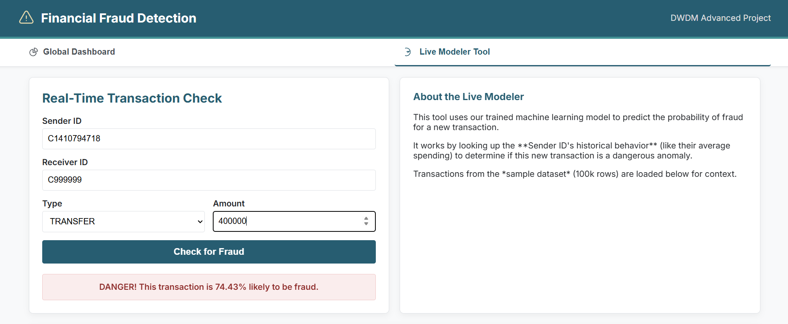
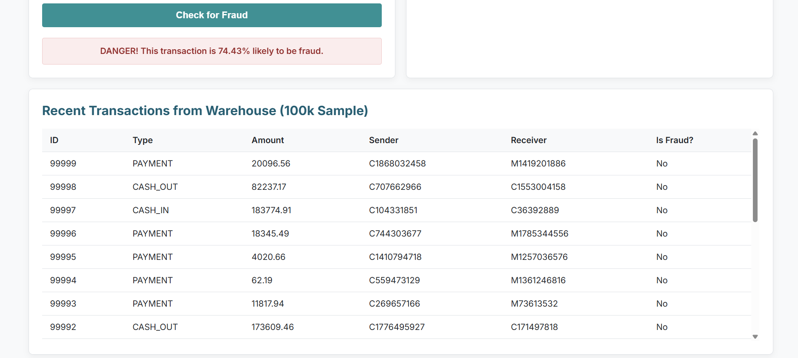

DWDM: Advanced Fraud Detection Project

This project is a complete Data Warehousing and Data Mining pipeline that detects financial fraud using a hybrid model (Behavioral Profiling + XGBoost).

Screenshots

Here is a preview of the final, working application.

Global Dashboard

The main dashboard shows a high-level overview of the entire 6.3-million-row dataset, including Key Performance Indicators (KPIs) and charts for transaction types and fraud rates.

Live Modeler Tool

The modeler tool uses the trained XGBoost model to predict the risk of a new transaction in real-time, based on the user's past behavioral patterns.

High-Risk Transaction (Anomalous Behavior):

Data Warehouse :

Project Pipeline

Data Warehouse (1_etl.py): A sample 100k-row data warehouse is built with a Star Schema (using Python and SQLite).

Advanced Features (2a_advanced_features.py): A data mining script creates personalized behavioral features for each user (e.g., sender_avg_amount, amount_vs_avg).

Model Training (2_model_training.py): A powerful XGBoost Classifier is trained on the advanced features. It learns to spot anomalies in a user's spending behavior.

Global Stats (3_global_stats.py): A script reads the entire 6.3M-row dataset to generate the statistics for the main dashboard.

Web Dashboard (app.py): A Flask server provides a two-page web interface to (1) view the global stats and (2) use the live prediction model.

How to Run This Project

1. Setup

A. Install Python Libraries
Make sure you have Python 3 installed. Then, create a virtual environment and install the required libraries:

# Create and activate a virtual environment
python -m venv .venv
source .venv/bin/activate  # (or .\.venv\Scripts\activate on Windows)

# Install libraries
pip install pandas flask scikit-learn networkx imbalanced-learn joblib matplotlib seaborn notebook xgboost

B. Get the Data
This project requires the PaySim dataset from Kaggle.

Download the dataset from: https://www.kaggle.com/datasets/ealaxi/paysim1

Unzip the file. You will find a file named PS_..._log.csv.

Rename this file to fraud_dataset.csv.

Place this file inside the data/ folder.

2. Run the 4-Step Data Pipeline

You must run these 4 scripts in order, one by one. They will build all the necessary database, model, and statistics files.

# Step 1: Builds the sample 100k-row database (fraud_dw.db)
python 1_etl.py

# Step 2: Creates the advanced features for model training (analytics_base_table.csv)
python 2a_advanced_features.py

# Step 3: Trains the XGBoost model on the new features (model.joblib)
python 2_model_training.py

# Step 4: Calculates stats for the main dashboard (global_stats.json)
python 3_global_stats.py

(Note: Step 4 may take a minute as it processes the full 6.3 million-row dataset.)

3. Run the Web Application

After the pipeline is complete and all 4 generated files exist, run the Flask app:

python app.py

Open your browser and go to http://127.0.0.1:5000 to see the dashboard.